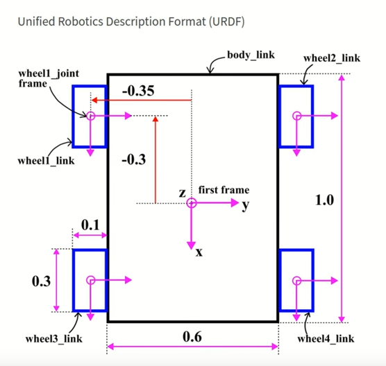

**Autonomous Mobile Robot Navigation Repository**

Welcome to the Autonomous Mobile Robot Navigation repository! This repository contains the code and resources necessary to enable autonomous navigation for a mobile robot using ROS (Robot Operating System). With this setup, you can give the robot a goal, and it will autonomously navigate to that goal while avoiding obstacles in its path.

### Contents:

1. **Robot Description Package:**
   - This package contains the URDF (Unified Robot Description Format) file describing the robot's physical structure.
   - Gazebo plugins necessary for simulation.
   - Map files used for navigation.

2. **Gazebo Package:**
   - Main launch file for starting the Gazebo simulation environment.

3. **Navigation Package:**
   - AMCL (Adaptive Monte Carlo Localization) launch file for localization.
   - GMapping launch file for SLAM (Simultaneous Localization and Mapping).
   - Move Base launch file for setting up the navigation stack.
   - Path planning using A* algorithm for generating optimal paths.
   - Map files required for navigation.
   - Configuration files and parameters for fine-tuning navigation behavior.

### Usage:

1. **Clone the Repository:**
   ```bash
   git clone https://github.com/yourusername/autonomous-mobile-robot.git
   ```

2. **Build the Workspace:**
   ```bash
   cd autonomous-mobile-robot
   catkin_make
   ```

3. **Launch the Gazebo Simulation:**
   ```bash
   roslaunch gazebo_pkg launch.launch
   ```

4. **Launch Navigation Stack:**
   - For AMCL localization:
     ```bash
     roslaunch navigation_pkg amcl.launch
     ```
   - For GMapping SLAM:
     ```bash
     roslaunch navigation_pkg gmapping.launch
     ```

5. **Send Navigation Goal:**
   Use RViz or any other ROS-compatible tool to send navigation goals to the robot. The robot will autonomously navigate to the specified goal while avoiding obstacles.

### Configuration:

- Adjust parameters in the provided configuration files to fine-tune navigation behavior, such as obstacle avoidance sensitivity, robot velocity, and map resolution.

### Path Planning Algorithm:

The path planning module in this repository utilizes the A* algorithm for generating optimal paths from the robot's current position to the specified goal location. This algorithm efficiently searches the space of possible paths, taking into account both the distance to the goal and the cost of traversing through obstacles.

### Localization and Mapping:

- **Localization Algorithm:** AMCL (Adaptive Monte Carlo Localization) is used for accurately estimating the robot's pose (position and orientation) within the map.
- **Mapping Algorithm:** GMapping is employed for building a map of the environment by incrementally updating the robot's pose and surroundings based on sensor data.

### The Robot Design:


### The Freme Tree:


### Video Of the full Project:
https://www.youtube.com/watch?v=x-95AC7PFDQ

### Issues and Contributions:

If you encounter any issues or have suggestions for improvements, please feel free to open an issue or create a pull request on GitHub. Your contributions are highly appreciated and will help improve the functionality and usability of this autonomous mobile robot navigation system.

